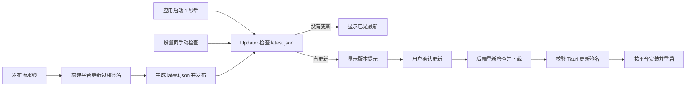

# CC Switch 自动更新机制调研与 power-switch 接入建议

调研日期：2026-09-25
调研对象：本机 `/Users/zbmain/workspace/tools/cc-switch`（Tauri 2，配置版本 3.20.3）与 power-switch v0.1.4。

## 结论摘要

CC Switch 使用 Tauri 官方 Updater 插件完成应用自更新：启动后延迟检查，设置页也可手动检查；发现新版本后提示用户，用户确认后由 Rust 后端重新检查、下载、验签、安装并重启。发布流水线为 macOS、Windows、Linux 构建更新专用文件及签名，生成 `latest.json`，并把更新清单和文件镜像到 Cloudflare R2。

power-switch 目前没有接入 Updater：Cargo、前端依赖、Tauri 配置和权限清单都没有 updater 插件设置；发布流程只生成面向用户手动安装的 12 个安装包和 `SHA256SUMS`。建议采用同一 Tauri Updater 技术路线，首期用 GitHub Release 的 `latest.json`，暂不增加 R2 镜像。现有 v0.1.4 客户端不会自动获得新能力，用户需先手动安装首个带更新器的版本，之后才可使用应用内更新。

## CC Switch 的实现流程

### 检查与提示

`src/contexts/UpdateContext.tsx` 在应用启动 1 秒后调用 `checkUpdate()`，检查超时设为 30 秒，并用 ref 避免并发检查。可用更新会显示在应用顶部的更新徽标和设置页“关于”区域。用户关闭提示后，已关闭的版本号保存在 `localStorage`，同一版本不再反复提示；新版本仍可提示。相关实现见 `src/contexts/UpdateContext.tsx:31-127`、`src/lib/updater.ts:25-48`、`src/components/UpdateBadge.tsx:11-41`。

`checkForUpdate()` 动态加载 `@tauri-apps/plugin-updater`，从 `tauri.conf.json` 的 endpoint 获取更新信息。设置页有手动检查入口；有更新时按钮改为“更新到 v…”并由用户点击安装。便携模式不会原地覆盖文件，而是打开 Releases 页面供手动下载。见 `src/components/settings/AboutSection.tsx:464-514` 和 `src-tauri/src/commands/misc.rs:67-75`。

### 下载、签名和重启

Tauri Updater 要求更新包签名，客户端内置公钥验证下载内容；签名不可关闭。私钥不放入仓库，由发布 workflow 从 `TAURI_SIGNING_PRIVATE_KEY` Secret 注入。丢失私钥会导致既有安装无法验证后续更新，因此私钥必须离线备份并限制访问。[Tauri Updater 官方文档](https://v2.tauri.app/plugin/updater/)说明了密钥生成、`pubkey`、更新工件和静态 JSON 清单格式。

CC Switch 的安装逻辑在 `src-tauri/src/commands/settings.rs:198-266`：后端在安装前重新检查版本，下载时发出字节进度事件，再调用 `install()`。Windows 会在安装前保存窗口状态、清理运行状态、移除托盘并释放单实例锁，因为 MSI 安装过程会退出当前进程；macOS/Linux 则先完成安装，再清理并重启。便携版走手动下载流程。Tauri 文档也说明 Windows 安装会退出当前进程，macOS/Linux 需要重新启动进程。[Tauri Updater JavaScript API](https://v2.tauri.app/zh-cn/reference/javascript/updater/)

### 发布与更新源

`src-tauri/tauri.conf.json:36-68` 开启 `createUpdaterArtifacts`，并配置公钥与两个更新源：R2 的 `latest.json` 优先，GitHub Releases 作为后备。`src-tauri/Cargo.toml` 和 `package.json` 引入 Rust/JavaScript updater 插件，`src-tauri/capabilities/default.json` 授予 updater 权限，应用初始化时注册插件。

发布 workflow 在 `.github/workflows/release.yml` 中准备更新签名私钥并构建平台包：

- macOS：通用 `.app.tar.gz` 及 `.sig` 用于应用内更新；DMG/ZIP 用于人工下载。
- Windows：MSI 及 `.sig` 用于应用内更新；Portable ZIP 不参与更新器。
- Linux：AppImage 及 `.sig` 用于应用内更新；DEB/RPM 仅供手动安装。

发布流程把签名写入 `latest.json`，平台键使用 `OS-ARCH`，文件 URL 指向版本化发布资产。之后 Release 先以预发布公开；维护者提升为正式 Latest 后，`.github/workflows/sync-r2.yml` 再镜像版本资产和根目录 manifest，并保留最近 5 个版本。`scripts/rewrite-updater-manifest.mjs` 只替换文件 URL，保留签名；`scripts/generate-download-manifest.mjs` 生成给下载页使用的清单，和 Tauri 的 `latest.json` 是两种用途。

官方 Tauri 文档指出：更新 endpoint 只有返回非 2xx 时才会继续尝试下一个地址；如果 R2 返回一个格式有效但过时的 `latest.json`，GitHub 后备源不会覆盖它。因此 CC Switch 对 R2 同步采用串行发布、只允许真正的 Latest 更新根清单，并在官方仓库缺少 R2 密钥时使同步失败，而不是留下静默过期的更新源。

## power-switch 当前状态

power-switch 的版本发布已能在 GitHub Actions 构建 macOS 通用版、Windows x64/ARM64、Linux x64/ARM64。`.github/workflows/release.yml` 负责构建，`scripts/release.mjs` 固定校验 12 个安装包，`scripts/publish-release.mjs` 上传文件并比对 GitHub 返回的 SHA-256。

目前尚无应用内更新入口：

- `src-tauri/Cargo.toml` 没有 `tauri-plugin-updater`，`package.json` 没有 `@tauri-apps/plugin-updater`。
- `src-tauri/tauri.conf.json` 只有 deep-link 插件配置，没有 updater 公钥、endpoint 或 `createUpdaterArtifacts`。
- `src-tauri/capabilities/default.json` 没有 updater 权限。
- 当前发行包没有 Tauri 更新专用 `.sig`、macOS `.app.tar.gz` 或 `latest.json`；README 和发布说明也写明升级通过 Releases 手动下载。

所以，现有 Release 可供人工更新，但应用本身不会查询新版本或安装更新。

## 给 power-switch 的接入方案

### 推荐范围

建议用 Tauri Updater 官方插件，保留现有 Release 页面作为人工下载入口，并另外生成更新工件。应用内更新适用于标准安装方式：macOS `.app`（配套 DMG 安装）、Windows MSI、Linux AppImage。Linux DEB/RPM、Windows ZIP 等平台包继续显示手动下载提示；包管理器和便携目录的更新不应被误认为已自动支持。

### 实施步骤

1. **准备签名密钥。** 使用 Tauri CLI 生成 updater key pair，将公钥写入 `tauri.conf.json`，私钥及口令存进 GitHub Actions Secret；离线备份私钥。此签名用于 updater 工件，macOS Developer ID 签名与公证是另一层分发信任，仍需单独决定。
2. **接入 Tauri 插件。** 加入 `tauri-plugin-updater`，在桌面端初始化。建议由 Rust 命令统一负责检查、下载、安装与重启，前端只显示版本、更新说明、进度、确认按钮和错误；如直接用 JS 插件命令，再配置 `updater:default` 权限。
3. **扩展发布工件。** 开启 `createUpdaterArtifacts`。CI 继续构建现有 12 个安装文件，同时收集 macOS `.app.tar.gz/.sig`、Windows MSI `.sig`、Linux AppImage `.sig`，并严格校验 5 个更新平台条目完整。`latest.json` 将版本、平台键、资产 URL 和签名写入 Release。
4. **接入更新界面。** 在设置/关于页提供“检查更新”和“更新到 vX”按钮。可借鉴 CC Switch 在启动后延迟检查、按版本记录“稍后提醒”；下载成功后必须显示明确的重启状态。下载失败或签名验证失败时保留当前安装并提示用户去 Releases 手动下载。
5. **上线顺序。** v0.1.4 及更早版本不含 updater 客户端，不能被远程更新器唤醒。先发布并手动安装首个含 updater 的版本；随后用该版本验证 macOS、Windows x64/ARM64、Linux AppImage 各自的签名、安装和重启。验证完成再推广给用户。

### 风险与取舍

- **信任根：** 客户端内置的 updater 公钥决定哪些安装包可被安装；私钥泄露会允许签发恶意更新，私钥丢失会让既有客户端无法更新。应限制 Secret 读写并离线备份。
- **平台差异：** Tauri updater 可生成 AppImage 更新工件；DEB/RPM、ZIP 仍应走手动流程，避免承诺未验证的覆盖安装行为。
- **更新源新鲜度：** 初期优先用一个 GitHub `latest.json` endpoint，减少镜像与后备源不一致的风险。若中国网络访问需要 CDN，再引入 R2 同步，并确保只有已验证的 Latest Release 能更新根清单。
- **macOS 信任：** updater 工件签名不能替代 macOS 应用代码签名/公证。power-switch 当前发布说明仍提示其未使用 Apple Developer 签名和公证，更新后的首次启动体验需要另行处理。
- **稳定版门控：** 当前工作流先发布预发布，再由维护者提升 Latest。更新清单应只让稳定版客户端看见已提升的 Latest，不能让预发布构建自动覆盖稳定更新源。

## 来源

- 本机源码：`/Users/zbmain/workspace/tools/cc-switch/src/contexts/UpdateContext.tsx`、`src/lib/updater.ts`、`src/components/settings/AboutSection.tsx`、`src-tauri/src/commands/settings.rs`、`src-tauri/tauri.conf.json`、`.github/workflows/release.yml`、`.github/workflows/sync-r2.yml`。
- 本机目标项目：`/Users/zbmain/workspace/tools/power-switch/src-tauri/tauri.conf.json`、`src-tauri/Cargo.toml`、`src-tauri/capabilities/default.json`、`.github/workflows/release.yml`、`scripts/release.mjs`、`scripts/publish-release.mjs`、`docs/releasing.md`。
- [Tauri Updater v2 官方文档](https://v2.tauri.app/plugin/updater/)
- [Tauri Updater JavaScript API](https://v2.tauri.app/zh-cn/reference/javascript/updater/)

## power-switch 接入进度（2026-09-25）

已按上述建议接入 Tauri Updater：应用启动时检查，左下角版本区展示新版本、下载进度和重启入口；发布工作流为 macOS、Windows、Linux 构建签名资产并生成 `latest.json`。更新签名使用独立密钥，只有公钥提交在 Tauri 配置，私钥保存在仓库外。

首次含更新器的版本仍须手动安装。GitHub 仓库需要先配置 `TAURI_SIGNING_PRIVATE_KEY` Actions Secret；预发布提升为正式版后，客户端才会通过 GitHub Latest Release 下载 `latest.json`。Windows 安装器会自动关闭应用，macOS/Linux 安装完成后提供手动重启按钮。
